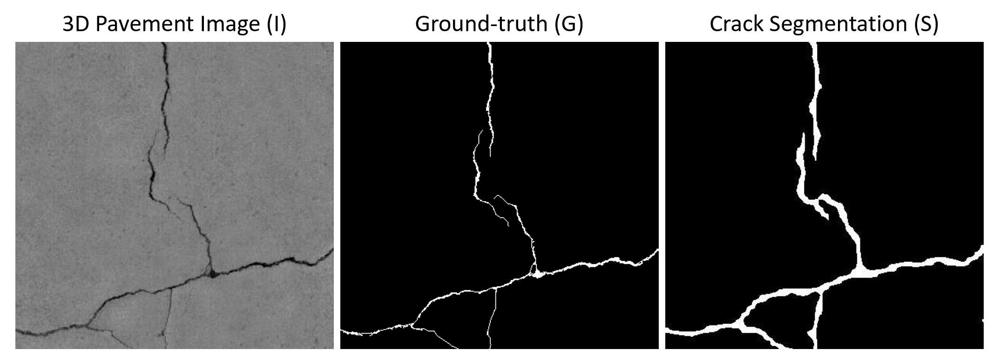

# Region- and Edge-based Active Contour for Automatic Crack Segmentation Refinement
## Final project for Gatech ECE 6560 - Partial Differential Equations in Image Processing and Computer Vision (Spring 2020)

This project aims at utilizing partial differential equations (PDEs) techniques as a post-processing step to refine the crack segmentation results generated by the deep CNN models. Specifically, a Region- and Edge-based Active Contour (REAC) is developed to refine the crack segmentation masks (S) generated from a FCN with ResNet50 backbone so that predictions closer to the ground-truth (G) can be avhieved. The details of the project can be found in the [report](https://github.com/yahsieh37/Region-and-Edge-Based-Active-Contours/blob/main/ECE6560_FinalReport.pdf).

### Dataset
The `test_data/` folder contains three subfolders:
- `range/`: The pavement images (I) with cracks
- `gt/`: The manual annotated ground-truth (G) of the cracks.
- `fcn_resnet50/`: The pixel-wise segmentation (S) of cracks gerenated by a FCN with ResNet50 backbone.

### Region- and Edge-based Active Contour (REAC):
The REAC is implmented in `REAC.m`. This script process a single sample for each run along with visulizing the evalution of the curves. To process a batch of samples, use `gen_results.m`, which calls `REAC_func.m` to process all samples in a folder and save the results in the `results/` folder. More instructions can be found in comments of the scripts.

### Evaluate the results:
After the segmentation masks are post-processed by REAC, use `test.m` to evaluate the results by comparing them with the ground-truth masks. This script calculates the Enhanced Hausdorff Distance (EHD) score [1] between the segmentation mask and the ground-truth. The evaluation results will be saved to the `eval_results/` folder.

[1] Tsai, Yi-Chang, and Anirban Chatterjee. "Comprehensive, quantitative crack detection algorithm performance evaluation system." Journal of Computing in Civil Engineering 31.5 (2017): 04017047.
